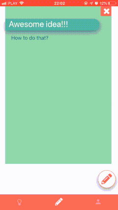
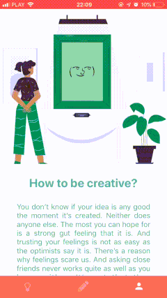

# AwesomeApp
> Whatever you do, do it well... in AwesomeApp!

## Table of contents
* [Demo](#demo)
* [Folders Structur](#folders-structur)
* [Usage](#usage)
* [Status](#status)

## Demo

## Folders Structure

- **actions** (actions for redux)
- **assets** (img, fonts etc.)
- **components** (only re useable part of code)
    - **[AccountComponents]** 
    - **[TodoListComponents]** 
    - **[HomeComponents]** 
- **constans** (only const variable)
- **entities** (typing for typescript)
- **reducers** (all reducers for redux)
- **screens** (all apps screens (pages))
    - **[Account]** 
    - **[TodoList]** 
    - **[Home]** 
- **tools** (reuseable tools)

## Usage

1. Download and install expo app on your phone
    - Android: https://play.google.com/store/apps/details?id=host.exp.exponent&hl=pl
    - iOS: https://itunes.apple.com/us/app/expo-client/id982107779?mt=8
    - after download app you must login to your profile in app
2. Start project:
    - you need node 11 (the newest version)
    - go to root folder
    - install yarn if you do not have
    - yarn install
    - npm install expo-cli --global
    - expo start --android/ expo start --ios
    - open http://localhost:19002 - Expo DevTools
    - click 'Tunnel' in lower left corner screen
    - in termin type "?" to open expo help
    - in termin type "s" and login to your account
3. Go to app in your phone
4. Scan QR code or click on link
5. Wait for download
6. Test your app :) -> hot reload is default after every time if you save file.
7. Building apk/ipa
    - expo build:android / expo build:ios (https://docs.expo.io/versions/latest/distribution/building-standalone-apps)
    - you can see progress: https://expo.io/builds
    
## Status
Project is:  _finished_

